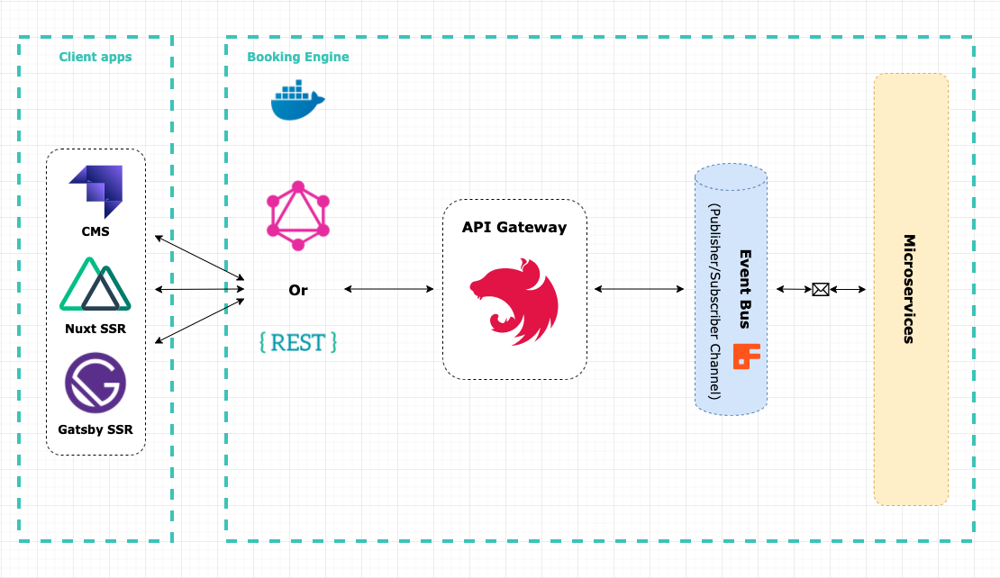

<br />
<p align="center">
  <a href="https://github.com/otasoft/otasoft-core">
    
  </a>

  <h1 align="center">Otasoft Core - Booking engine for Online Travel Agencies</h1>

  <p align="center">
    <!-- <a href="https://github.com/otasoft/otasoft-core"><strong>Explore the docs »</strong></a> -->
    <!-- <a href="https://github.com/otasoft/otasoft-core">View Demo</a> -->
    <!-- · -->
    <a href="https://github.com/otasoft/otasoft-core/issues">Report Bug</a>
    ·
    <a href="https://github.com/otasoft/otasoft-core/issues">Request Feature</a>
  </p>
  <p align="center">
    <a href="https://github.com/otasoft/otasoft-api/actions"></a>
</p>

## About The Project
Otasoft Core is a Nest.js based booking engine for Online Travel Agencies (OTA's). Thanks to the microservice architecture, business logic is separated into different services allowing for greater scallability, extensibility, and separation of concerns. Otasoft Core can be configured in many ways to suit your business needs:

* Databases, message brokers, authentication methods, and many more can all be configured to connect to the new or existing infrasctructure
* Works great with both REST and GraphQL
* Each microservice is a separate project(repo) that allows distributed development teams to work seamlessly
* Modules are separate entities, so you can choose which services you would like to use in your system
* Connect any modern frontend application. By default, we have Nuxt (Vue.js) and Gatsby (React.js) frontends already implemented and ready to use.

Otasoft projects are and always will be open source (MIT Licence). Anyone can use and support the project. The project is currently in the development phase.


## Table of Contents

* [Getting Started](#getting-started)
* [Usage](#usage)
* [Architecture](#architecture)
* [Layers](#layers)
* [Core Team](#core-team)
* [Roadmap](#roadmap)
* [Contributing](#contributing)
* [How to support?](#how-to-support?)
* [License](#license)

<!-- GETTING STARTED -->
## Getting Started

To start developing the project please check if you have these tools installed on your machine:

* [Node.js](https://nodejs.org/en/download/)
* [Yarn](https://yarnpkg.com/getting-started/install)
* [Docker](https://www.docker.com/get-started)

Installation

1. Clone the repo
```sh
git clone https://github.com/otasoft/otasoft-core
```
2. Install all projects dependencies
```sh
sh scripts/install.sh
```
3. Copy .env.example file as .env and fill it with your environment variables
```sh
cp .env.example .env
```
4. Run docker-compose for all projects or for each individual project
```sh
docker-compose up
```
5. Run project
```sh
yarn start:dev
```

## Architecture
 
The Otasoft API acts as a gateway/proxy for the different microservices it exposes. The GraphQL resolvers and REST controllers make calls to the RabbitMQ microservices through client-server communication. All elements of the Otasoft Core system are packed into docker images and can be run as containers.



This architecture implements the following Microservice Design Patterns:

1. [Microservice Architecture](https://microservices.io/patterns/microservices.html)
2. [Subdomain Decomposition](https://microservices.io/patterns/decomposition/decompose-by-subdomain.html)
3. [Externalized Configuration](https://microservices.io/patterns/externalized-configuration.html)
4. [Remote Procedure Invocation](https://microservices.io/patterns/communication-style/rpi.html)
5. [API Gateway](https://microservices.io/patterns/apigateway.html)
6. [Database per Service](https://microservices.io/patterns/data/database-per-service.html)
7. [CQRS](https://microservices.io/patterns/data/cqrs.html)

## Layers

### API Layer

Otasoft API built using [NestJS](https://nestjs.com/) acts as the API Layer for the architecture. It takes care of listening for client requests and calling the appropriate back-end microservice to fulfill them.

### Microservice Layer

[NestJS + RabbitMQ](https://www.rabbitmq.com/) was chosen as the framework for the creation of the microservices. Each service has its own database and thanks to that, microservices can work independently. All microservices are closed for any connection except the one that is coming from API Gateway.

### Persistence Layer

PostgreSQL and MySQL are used as the databases and [TypeOrm](https://typeorm.io/) is used as the Object-Relational Mapper (ORM).

<!-- CORE TEAM -->
## Core Team

[Jakub Andrzejewski](https://github.com/Baroshem) -> Founder, Developer

[Adam Oleszko](https://github.com/AdamOleszko) -> Core Team Member, Developer

[Tomasz Anioł](https://github.com/tom-aniol) -> Core Team Member, Marketing

[Kamil Wanzek](https://www.linkedin.com/in/kamil-wanzek/) -> Core Team Member, UX/UI Designer

<!-- ROADMAP -->
## Roadmap

See the [open issues](https://github.com/otasoft/otasoft-core/issues) for a list of proposed features (and known issues).

<!-- CONTRIBUTING -->
## Contributing

You are welcome to contribute to Otasoft projects. Please see [contribution tips](CONTRIBUTING.md)

<!-- SUPPORT -->
## How to support?
Otasoft projects are and always will be Open Source.

Core team and contributors in the Otasoft ecosystem spend their free and off work time to make this project grow. If you would like to support us you can do so by:

- contributing - it does not matter whether it is writing code, creating designs, or sharing knowledge in our e-books and pdfs. Any help is always welcome! 
- evangelizing - share a good news about Otasoft projects in social media or during technology conferences ;)

<!-- LICENSE -->
## License

Distributed under the [MIT licensed](LICENSE). See `LICENSE` for more information.